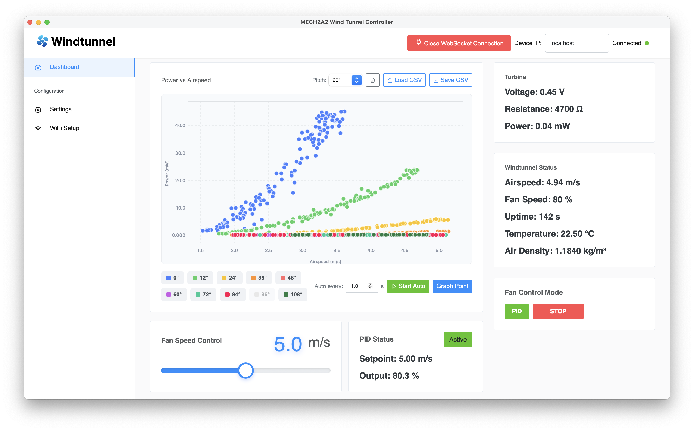
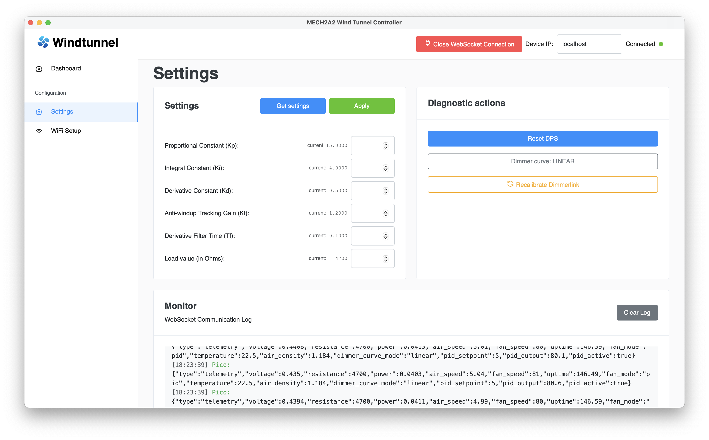
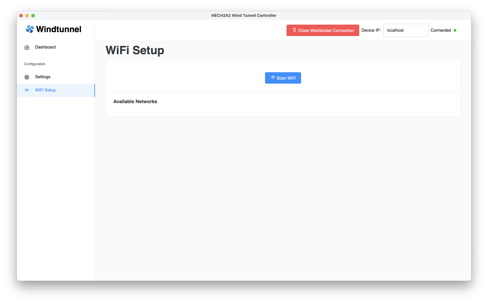

# MECH2A2 Wind Tunnel Controller

Desktop control software for the MECH2A2 wind tunnel rig, built for the P&O 2 course at KU Leuven. The app is a Tauri (Rust + vanilla JS) cross-platform GUI that talks to a Raspberry Pi Pico W (CircuitPython firmware in [`python/code.py`](python/code.py)) over WebSocket. This application allows the user to control the fan and plot power generation.

## Screenshots

### Dashboard

### Settings

### WiFi setup

## Repository layout

- [`control-app/`](control-app) — Tauri desktop app (Rust backend in [`src-tauri/`](control-app/src-tauri), web frontend in [`src/`](control-app/src)).
- [`python/`](python) — CircuitPython firmware for the Raspberry Pi Pico W on the tunnel.

## macOS install guide:

1. Download the correct installer from the releases (Apple Silicon or Intel)
2. Drag the app into the Applications folder
3. Run this in the terminal: `sudo xattr -dr com.apple.quarantine '/Applications/MECH2A2 Wind Tunnel Controller.app/'`
4. Enjoy

## Building instructions:

Run `npm run tauri build`

## How to run (for dev mode):

1. Install dependencies (Rust, Node)
2. Run `npm install`
3. Run `npm run tauri dev`

## Known issues:
- Buttons (like the one to switch to PID) do not always work, they have to be pressed multiple times.
- The DimmerLink curve toggle does not work (linear works well enough for this control loop).
- The Wi-Fi connection feature is currently untested.
